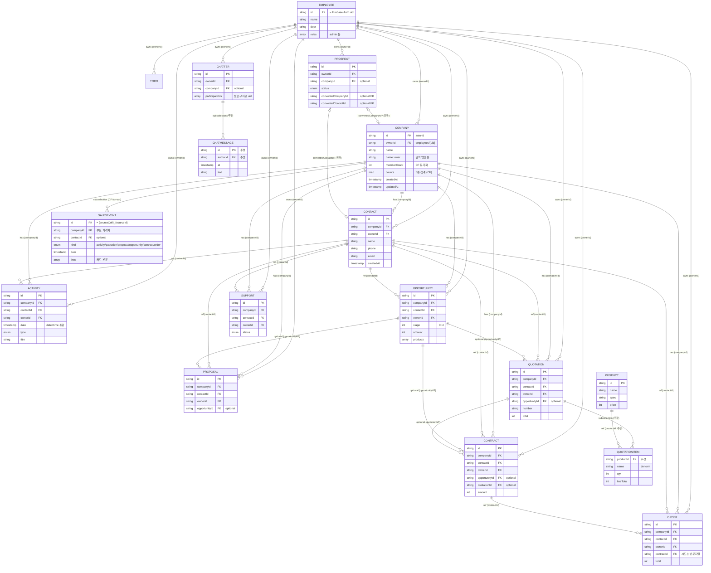

# final_CRM ERD & 마이그레이션 갭 문서

> 작성: 2026-06-25 · 읽기 분석 기반(코드 미수정)
> 분석 파일: `src/lib/types.ts`, `src/lib/mock-data.ts`, `src/lib/firestore-types.ts`, `functions/src/index.ts`, `scripts/seed-firestore.ts`

이 문서는 두 관점의 ERD를 함께 제공합니다.

1. **도메인 개념 ERD** — 현행 화면/목업 코드(`types.ts` + `mock-data.ts`)가 실제로 동작하는 방식. 엔티티가 **이름 문자열**로 느슨하게 연결됨.
2. **목표 Firestore 스키마 ERD** — 영속 계층(`firestore-types.ts` + Cloud Functions). **ID 기반 FK**로 정규화됨.

두 그림의 차이가 곧 "현행 → 목표" 마이그레이션 작업 목록입니다(맨 아래 갭 표 참조).

---

## 1. 도메인 개념 ERD (현행 — 이름 문자열 연결)

`mock-data.ts`의 조인 로직(`a.company === company`, `q.company === activity.company` 등)이 근거입니다. **명시적 FK 없음** — 모든 링크는 표시용 이름(거래처명/고객명/담당자명/제품명) 일치로 성립.

```mermaid
erDiagram
    EMPLOYEE ||--o{ COMPANY : "owns (ownerName)"
    EMPLOYEE ||--o{ CONTACT : "owns (ownerName)"
    EMPLOYEE ||--o{ ACTIVITY : "owns (owner)"
    EMPLOYEE ||--o{ OPPORTUNITY : "owns"
    EMPLOYEE ||--o{ PROPOSAL : "owns (owner)"
    EMPLOYEE ||--o{ QUOTATION : "owns (owner)"
    EMPLOYEE ||--o{ CONTRACT : "owns (owner)"
    EMPLOYEE ||--o{ ORDER : "owns (owner)"
    EMPLOYEE ||--o{ SUPPORT : "owns (owner)"
    EMPLOYEE ||--o{ PROCEEDING : "owns (owner)"
    EMPLOYEE ||--o{ PROSPECT : "owns (owner)"
    EMPLOYEE ||--o{ TODO : "assigned (owner)"
    EMPLOYEE ||--o{ NOTICE : "authors (author)"
    EMPLOYEE ||--o{ SALESREPORT : "authors (author)"

    COMPANY ||--o{ CONTACT : "has (company name)"
    COMPANY ||--o{ ACTIVITY : "has (company name)"
    COMPANY ||--o{ OPPORTUNITY : "has (company name)"
    COMPANY ||--o{ PROPOSAL : "has (company name)"
    COMPANY ||--o{ QUOTATION : "has (company name)"
    COMPANY ||--o{ CONTRACT : "has (company name)"
    COMPANY ||--o{ ORDER : "has (company name)"
    COMPANY ||--o{ SUPPORT : "has (company name)"
    COMPANY ||--o{ PROCEEDING : "has (company name)"
    COMPANY ||--o{ PROSPECT : "linked (company name)"
    COMPANY ||--|| COMPANYCOUNTS : "embeds (rollup)"

    CONTACT ||--o{ ACTIVITY : "subject of (contact name)"
    CONTACT ||--o{ OPPORTUNITY : "subject of (contact name)"
    CONTACT ||--o{ PROPOSAL : "subject of (contact name)"
    CONTACT ||--o{ QUOTATION : "subject of (contact name)"
    CONTACT ||--o{ CONTRACT : "subject of (contact name)"
    CONTACT ||--o{ ORDER : "subject of (contact name)"
    CONTACT ||--o{ SUPPORT : "subject of (contact name)"
    CONTACT ||--o{ CONTACTEVENT : "displays (embedded)"

    CONTRACT ||--o| ORDER : "generates (contractTitle, soft/broken)"

    PRODUCT }o--o{ OPPORTUNITY : "referenced by name"
    PRODUCT }o--o{ QUOTATION : "referenced by name"
    PRODUCT }o--o{ CONTRACT : "referenced by name"

    COMPANY ||--o{ SALESEVENT : "timeline (derived)"

    COMPANY {
        string id PK
        string name UK "거래처명 - de-facto join key"
        int    memberCount
        string ownerName FK "Employee.name (soft)"
        int    amount
        object counts "embedded CompanyCounts"
    }
    CONTACT {
        string id PK
        string name "고객명 - join key used by others"
        string company FK "Company.name (soft)"
        string ownerName FK "Employee.name (soft)"
        string dept
        string position
        string phone
        string email
    }
    EMPLOYEE {
        string id PK
        string name UK "담당자 - de-facto join key"
        string dept
        array  roles
    }
    ACTIVITY {
        string id PK
        string date
        string time
        enum   type "방문/전화/업무협의/메일/교육"
        string title
        string company FK "Company.name (soft)"
        string contact FK "Contact.name (soft)"
        string owner FK "Employee.name (soft)"
        string dept
    }
    OPPORTUNITY {
        string id PK
        string title
        int    stage "0-4, 확률=stage*25"
        string company FK "soft"
        string contact FK "soft"
        int    amount
        array  products "Product names (soft)"
    }
    PROPOSAL {
        string id PK
        string title
        string company FK "soft"
        string contact FK "soft"
        string owner FK "soft"
    }
    QUOTATION {
        string id PK
        string number UK
        string title
        string company FK "soft"
        string contact FK "soft"
        string owner FK "soft"
        int    total
    }
    CONTRACT {
        string id PK
        string title
        string company FK "soft"
        string contact FK "soft"
        string product "Product name (soft)"
        int    amount
    }
    ORDER {
        string id PK
        string customer
        string contractTitle FK "Contract.title (soft/MISMATCHED)"
        string company FK "soft"
        int    total
    }
    SUPPORT {
        string id PK
        string title
        string company FK "soft"
        string contact FK "soft"
        enum   status "처리중/완료"
    }
    PROSPECT {
        string id PK
        string name
        string company FK "soft"
        enum   status "미접촉/접촉중/접촉금지/고객전환"
    }
    PROCEEDING {
        string id PK
        string title
        string company FK "soft"
        string attendeesClient "comma names (soft)"
        string attendeesOwn "comma names (soft)"
    }
    PRODUCT {
        string id PK
        string name "referenced by name only"
        string spec
        int    price
    }
    COMPANYCOUNTS {
        int opportunity
        int activity
        int quotation
        int contract
        int support
    }
```

### 정합성 리스크 (현행)

- **모든 연결이 이름 문자열** → 동명이인·거래처명 변경에 취약.
- **`Order` ↔ `Contract` 링크가 데이터상 깨져 있음**: Order는 `"한국야금 CRM 구축형 계약"`, Contract는 `"CRM 구축 계약"` 로 `contractTitle`이 실제 `Contract.title`과 불일치.
- `Product`는 카탈로그일 뿐 `id`로 참조되지 않음. 견적 라인아이템 테이블이 없어 다품목 견적 모델링 불가.
- `SalesEvent`/`ContactEvent`/`RecentItem`/`CompanyCounts`는 정규 엔티티가 아닌 파생/표시용.

---

## 2. 목표 Firestore 스키마 ERD (ID 기반 FK)

`firestore-types.ts` + `functions/src/index.ts` + `seed-firestore.ts` 기준. **ID 기반 FK**로 정규화. 모든 트랜잭션 엔티티가 `ownerId`(`employees/{uid}`), `companyId`, `contactId`를 보유.

### Cloud Functions로 유지되는 파생 관계

| 함수 | 트리거 소스 | 효과 |
|---|---|---|
| `count{Opportunities,Activities,Quotations,Contracts,Supports}` | 5개 컬렉션 onWrite | `companies/{id}.counts.<field>` 증감 |
| `syncMemberCount` | `contacts` onWrite | `companies/{id}.memberCount` 증감 |
| `fanout{Activities,Quotations,Proposals,Opportunities,Contracts,Orders}` | 6개 컬렉션 onWrite | `companies/{id}/salesEvents/{coll}_{sourceId}` upsert/delete |
| `backfillAggregates` | HTTPS callable (admin) | counts/memberCount/salesEvents 전체 재계산 |

> 참고: `counts`는 5종(opportunity/activity/quotation/contract/support)만 집계, `salesEvents` fan-out은 6종(proposal/order 포함, support 제외) — 두 집합이 다름.

### 추정/미구현 항목

- `QUOTATIONITEM`, `CHATMESSAGE`: 타입만 정의되고 서브컬렉션 경로·생성 코드 없음 → 추정.
- `PROSPECT.convertedCompanyId/convertedContactId`: 타입에만 존재, 전환 로직 없음.
- `OPPORTUNITY→QUOTATION/PROPOSAL/CONTRACT` 의 `opportunityId`, `QUOTATION→CONTRACT` 의 `quotationId`: 타입상 선택적 FK이나 시드는 미작성(런타임 입력 의존).
- `ORDER.contractId`: 시드에서 빈 문자열(`""`).

---

## 3. 마이그레이션 갭 표 (현행 도메인 → 목표 Firestore)

| # | 현행 (도메인/목업) | 목표 (Firestore) | 작업 |
|---|---|---|---|
| 1 | `company`(거래처명 문자열)로 연결 | `companyId` FK | 모든 자식 엔티티에서 이름 → `companyId` 치환 + denorm `company` 유지 |
| 2 | `contact`(고객명 문자열)로 연결 | `contactId` FK | 동명이인 모호성 해소. 이름 → `contactId` 치환 |
| 3 | `owner`/`author`(담당자명 문자열) | `ownerId` = `employees/{uid}` | 이름 → uid 매핑(`empIdByName` 패턴 존재) |
| 4 | `Order.contractTitle` (불일치/깨짐) | `Order.contractId` FK | **데이터 정합성 버그 수정** — 실제 계약과 연결 |
| 5 | `products[]`/`product` (제품명 문자열) | `productId` FK + `QuotationItem` 서브컬렉션 | 다품목 견적 라인아이템 테이블 도입 |
| 6 | `Prospect.status='고객전환'` (링크 없음) | `convertedCompanyId`/`convertedContactId` | 전환 추적 FK 채우는 전환 로직 구현 |
| 7 | `CompanyCounts`(목업 고정값) | `companies.counts` (CF 자동 집계) | 클라이언트 계산 제거, CF 트리거 의존 |
| 8 | 상세화면 `getSalesEventsByCompany()` (런타임 조인) | `companies/{id}/salesEvents` 서브컬렉션 (CF fan-out) | 런타임 필터 → 사전 계산된 타임라인 읽기로 전환 |
| 9 | `Opportunity↔Quotation↔Contract` 연결 없음 | `opportunityId`/`quotationId` 선택 FK | 영업 파이프라인 단계 연결 채우기 |
| 10 | `Proceeding.attendees*` (콤마 이름 문자열) | (선택) 참석자 FK 배열 | 정규화 여부 결정 — 현행 유지도 가능 |

### 한 줄 요약
실제 DB 전환의 핵심은 **(1) 모든 이름 문자열 링크를 `id` FK로 교체, (2) `Order.contractId`·`QuotationItem`·`Prospect` 전환 FK 등 누락 관계 신설, (3) `CompanyCounts`/`SalesEvent`/`RecentItem`은 파생 데이터로 취급(CF가 유지)** 입니다.
